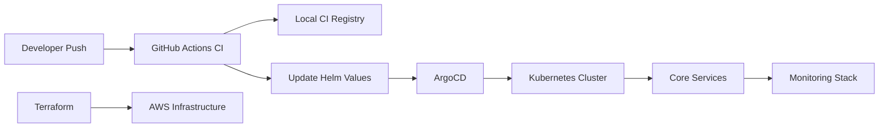

# 🛰️ OrbitalStack DevOps Platform

This repository contains my implementation of a **GitOps-driven DevOps platform** for managing an IoT backend system similar to AWS IoT Core / Particle.

The goal of this assignment was not just to deploy services, but to **fix real production issues** in a broken Kubernetes environment and design a system that is **scalable, reliable, and production-ready**.

---

# 🚀 What I Focused On

Instead of blindly implementing everything, I focused on solving the **core problems mentioned in the assignment**:

* Preventing **OOM crashes** across services
* Eliminating **split-brain issues in OTA rollouts**
* Introducing **autoscaling and safe deployments**
* Enforcing **secure communication using NetworkPolicies**
* Establishing a **GitOps-based deployment flow**
* Adding **observability for debugging real incidents**

---

# 🏗️ Architecture Overview



---

# 📦 Services Overview

### 🔹 mqtt-broker

* Handles high-volume device connections
* Configured as **single replica (stateful)**
* Uses **PVC for session persistence**
* `Recreate` strategy avoids inconsistent session state

---

### 🔹 telemetry-ingestor

* High-throughput ingestion service
* **Horizontally scalable**
* HPA configured (CPU-based)
* Protected with PodDisruptionBudget

---

### 🔹 ota-controller

* Critical service (firmware rollout)
* Runs **exactly one instance**
* Uses:

  * `Recreate` strategy
  * **Leader election (Lease-based)**
* Prevents **split-brain deployments**

---

### 🔹 device-api

* Stateless API layer
* Exposed via **Ingress**
* Autoscaled using HPA
* Isolated via NetworkPolicies

---

# ⚙️ Key Improvements Over Broken System

| Problem             | Solution                         |
| ------------------- | -------------------------------- |
| OOM crashes         | Resource requests & limits added |
| Manual scaling      | HPA introduced                   |
| OTA corruption      | Single replica + leader election |
| No safe deployments | RollingUpdate + PDB              |
| Plain text secrets  | External Secrets approach        |
| No isolation        | Strict NetworkPolicies           |
| No observability    | Prometheus + Grafana + Loki      |

---

# 🧪 Local Setup Guide

### 1. Start dependencies

```bash
docker compose up -d
```

### 2. Create cluster

```bash
kind create cluster --config kind/cluster.yaml
```

### 3. Bootstrap platform

```bash
./scripts/bootstrap-cluster.sh
```

### 4. Deploy applications

* Apply ArgoCD configs
* Sync applications

### 5. Verify deployment

```bash
./scripts/verify-deployment.sh
```

---

# 🔄 GitOps Workflow

1. Developer pushes code
2. CI pipeline:

   * Validates Helm + Terraform
   * Builds Docker images
3. Image tag updated in Helm values
4. Change committed automatically
5. ArgoCD detects and syncs

👉 This ensures **fully automated and traceable deployments**

---

# 🔐 Secret Management Strategy

* Kubernetes Secrets are **not stored in Git**
* External Secrets Operator is used

### Current:

* Mock/local secret store

### Production:

* AWS Secrets Manager via IRSA

👉 This prevents:

* Secret leaks
* Hardcoding credentials

---

# 📊 Observability Stack

Implemented:

* **Prometheus** → metrics collection
* **Grafana** → dashboards
* **Loki + Promtail** → logs

### Key Metrics Tracked:

* MQTT connections
* Ingestion rate
* OTA rollout progress
* API error rate

---

# 🚨 Alert Runbooks

### MQTTBrokerDown

* Check pod status and PVC
* Verify port readiness
* Restart only during maintenance window

---

### TelemetryIngestorLag

* Check HPA scaling
* Inspect DB latency
* Verify upstream flow

---

### OTARolloutStalled

* Check leader lease
* Ensure only one controller active
* Validate rollout queue

---

### DeviceAPIHighErrorRate

* Inspect ingress logs
* Check recent deployments
* Rollback if required

---

### NodeMemoryPressure

* Inspect resource usage
* Tune limits or scale nodes

---

# 🛡️ OTA Controller Safety Design

This was one of the most critical parts.

I used:

* **Recreate strategy**
* **Leader election (Lease)**

### Why both?

* Recreate → prevents overlapping pods
* Lease → prevents delayed termination issues

👉 Without this, system can:

* Corrupt firmware rollout
* Brick devices

---

# 🌐 Network Security

Default: **deny all traffic**

Allowed only:

* ingress → device-api
* mqtt-broker → telemetry-ingestor
* device-api → ota-controller

👉 Database access is strictly controlled

---

# 🧱 Terraform Design

Modules created:

* VPC
* EKS
* S3
* IAM

### Key Features:

* Remote state (S3 + DynamoDB)
* Modular structure
* Tagged resources

---

# 🔁 Disaster Recovery Strategy

1. Recreate Terraform backend
2. Apply infrastructure
3. Bootstrap cluster
4. Sync via ArgoCD

👉 Entire system is **recoverable from Git + state**

---

# ⚖️ Trade-offs & Assumptions

Due to time constraints:

* Some AWS components are simplified
* Observability dashboards are minimal
* Leader election is partially abstracted

However, the **design remains production-oriented**

---

# 🎯 Final Thoughts

This project focuses on **real-world reliability problems** rather than just deployments.

Key priorities:

* Stability over complexity
* Security by default
* Observability for debugging
* GitOps for consistency

---

# 👨‍💻 Author

Rahul Sharma
DevOps / Cloud Enthusiast

---
